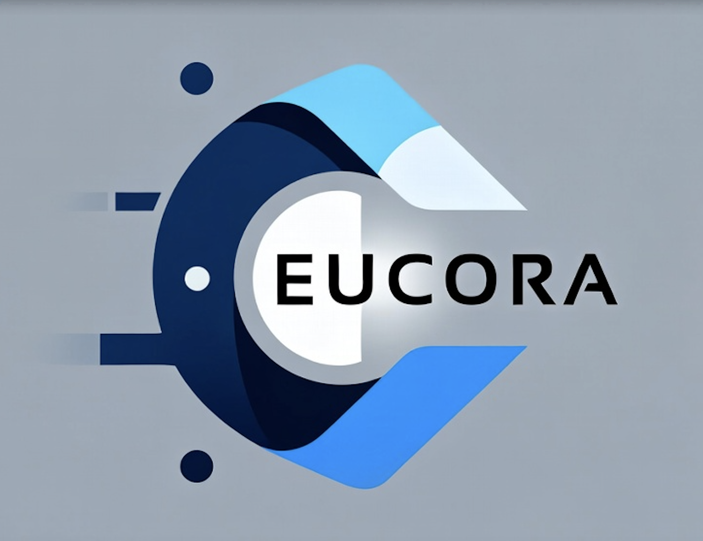

<p align="center">
  
</p>

<h1 align="center">EUCORA</h1>
<h3 align="center">End-User Computing Orchestration & Reliability Architecture</h3>

<p align="center">
  <strong>Enterprise-Grade Endpoint Application Packaging & Deployment Factory</strong>
</p>

<p align="center">
  <em>Built by <a href="https://buildworks.ai">BuildWorks.AI</a></em>
</p>

<p align="center">
  <a href="#overview">Overview</a> •
  <a href="#key-capabilities">Capabilities</a> •
  <a href="#architecture">Architecture</a> •
  <a href="#getting-started">Getting Started</a> •
  <a href="#documentation">Documentation</a>
</p>

---

## Overview

**EUCORA** is a platform engineering solution that brings strict control plane discipline to enterprise endpoint management. It serves as a unified orchestration layer for policy, evidence, and reliability across heterogeneous execution planes including **Intune**, **Jamf**, **SCCM**, **Landscape**, and **Ansible**.

### The Problem We Solve

Managing 50,000+ endpoints across acquisitions with 5,000+ applications creates unacceptable risk in:
- **Security**: Privilege sprawl, unverified software, weak auditability
- **Operations**: Configuration drift, inconsistent deployment outcomes
- **Governance**: CAB evidence gaps, non-deterministic approvals

### Our Approach

EUCORA implements a **thin Control Plane** that standardizes the enterprise application lifecycle without replacing existing MDM infrastructure. The platform decides **what** should happen; existing tools execute **how** it happens.

---

## Key Capabilities

| Capability | Description |
|------------|-------------|
| **🎯 Thin Control Plane** | Separates policy intents from execution details across all platforms |
| **📋 Evidence-First Governance** | CAB-ready evidence packs with hashes, signatures, SBOMs for every change |
| **🔄 Ring-Based Rollouts** | Deterministic promotion gates (Lab → Canary → Pilot → Department → Global) |
| **🌐 Hybrid Distribution** | Intelligent content handling for Online, Intermittent, and Air-gapped sites |
| **🔍 Drift Detection** | Continuous reconciliation loops enforcing desired state |
| **⚖️ Risk Scoring** | Deterministic risk assessment with versioned scoring rubrics |
| **🤖 AI Agent Hub** | 12 specialized AI agents (E10-E21) for application lifecycle management automation |
| **🧠 RAG Pipeline** | Document management, vector storage (pgvector), and semantic search |
| **📊 Multi-Cloud Storage** | Storage abstraction supporting MinIO, AWS S3, and Azure Blob |
| **🔐 Comprehensive RBAC** | 9 roles with 197 permissions and scope-based access control |
| **📱 1E DEX Integration** | Digital employee experience metrics and telemetry |

---

## Architecture

```
                   ┌──────────────────────────────────────────────┐
                   │                  Control Plane               │
                   │ Policy + Orchestration + Evidence (Thin)     │
                   │                                               │
                   │  ┌─────────────────────────────────────┐    │
                   │  │   AI Workflow Engine + ALM Agents    │    │
                   │  │   (E10-E21: Planning, SecOps, SRE,  │    │
                   │  │    KB Triage, SLA, Discovery, etc.) │    │
                   │  └─────────────────────────────────────┘    │
                   │                                               │
                   │  ┌─────────────────────────────────────┐    │
                   │  │   RAG Pipeline (Document Management │    │
                   │  │   + Vector Storage + Semantic Search)│    │
                   │  └─────────────────────────────────────┘    │
                   └───────────────┬──────────────────────────────┘
                                   │
                   ┌───────────────▼──────────────────────────────┐
                   │        Packaging & Publishing Factory         │
                   │ Build → Sign/Notarize → SBOM/Vuln → Test      │
                   └───────────────┬──────────────────────────────┘
                                   │
          ┌────────────────────────▼────────────────────────┐
          │                 Execution Planes                 │
          │ Intune | Jamf | SCCM | Landscape | Ansible       │
          └───────────────┬──────────────────────────────────┘
                          │
          ┌───────────────▼──────────────────────────────────┐
          │                  Endpoint Devices                 │
          │ Windows | macOS | Ubuntu | iOS/iPadOS | Android   │
          └──────────────────────────────────────────────────┘
```

### Core Principles

1. **Determinism** — No "AI-driven deployments"; all approvals and gates are explainable
2. **Separation of Duties** — Packaging ≠ Publishing ≠ Approval
3. **Idempotency** — Every deployment action can be retried safely
4. **Reconciliation over Hope** — Continuous desired-vs-actual drift detection
5. **Evidence-First Governance** — CAB decisions include standardized evidence packs
6. **Offline is First-Class** — Explicit distribution strategy per site class

---

## Platform Support

| Platform | Primary | Secondary | Notes |
|----------|---------|-----------|-------|
| Windows | Intune | SCCM | Legacy OS / constrained sites |
| macOS | Intune | Jamf | Jamf where deeper controls required |
| Ubuntu/Linux | Landscape / Ansible | Agent fallback | Signed APT repo as standard |
| iOS/iPadOS | Intune | — | ABM + ADE |
| Android | Intune | — | Android Enterprise |

---

## Technology Stack

### Backend
- **Django 5.x** with Django REST Framework
- **PostgreSQL** with **pgvector** extension for vector storage
- **Redis** for caching and task queues
- **Celery** for async task processing
- **AI Integration**: OpenAI, Azure OpenAI, local models

### Frontend
- **React 18** with TypeScript
- **Vite** for build tooling
- **Tailwind CSS** with shadcn/ui components
- **TanStack Query** for server state management

### Infrastructure
- **Docker** for containerization
- **Pre-commit hooks** for quality gates
- **Multi-cloud storage**: MinIO, AWS S3, Azure Blob Storage

---

## Getting Started

### Prerequisites

- Docker & Docker Compose
- Python 3.10+ (for backend development)
- Node.js 18+ (for frontend development)
- PowerShell 7+ (for CLI tooling)

### Quick Start

```bash
# Clone the repository
git clone https://github.com/buildworksai/EUCORA.git
cd EUCORA

# Start development environment
docker compose -f docker-compose.dev.yml up -d

# Install pre-commit hooks (required for development)
pip install pre-commit && pre-commit install
```

### Development Setup

See [docs/DEVELOPMENT_SETUP.md](docs/DEVELOPMENT_SETUP.md) for complete development environment configuration including:
- Pre-commit hooks and quality gates
- SPDX compliance checks
- Backend and frontend development workflows
- CI/CD integration details

---

## Documentation

### Architecture

| Document | Description |
|----------|-------------|
| [Architecture Overview](docs/architecture/architecture-overview.md) | System-of-record for architectural decisions |
| [Control Plane Design](docs/architecture/control-plane-design.md) | Control Plane component specifications |
| [AI Agents Architecture](docs/architecture/ai-agents-architecture.md) | AI agent orchestration and coordination |
| [ALM Agents Architecture](docs/architecture/alm-agents-architecture.md) | Application lifecycle management agents (E10-E21) |
| [RAG Pipeline Architecture](docs/architecture/rag-pipeline-architecture.md) | Document management and semantic search |
| [Risk Model](docs/architecture/risk-model.md) | Risk scoring formula, factors, and rubrics |
| [Ring Model](docs/architecture/ring-model.md) | Ring-based rollout and promotion gates |
| [CAB Workflow](docs/architecture/cab-workflow.md) | Change Advisory Board approval process |

### User Guides

**Phase 2 Agent User Guides**:
- [Planning Agent](docs/user-guides/planning-agent.md) - AI-powered deployment planning
- [SecOps Agent](docs/user-guides/secops-agent.md) - Vulnerability management and compliance
- [SRE Agent](docs/user-guides/sre-agent.md) - Site reliability engineering automation
- [KB & Triage Agent](docs/user-guides/kb-triage-agent.md) - Knowledge base and ticket triage
- [SLA Governance Agent](docs/user-guides/sla-governance-agent.md) - SLA definition and compliance
- [Request Coordination Agent](docs/user-guides/request-coordination-agent.md) - Service request tracking
- [CMDB Integration Agent](docs/user-guides/cmdb-integration-agent.md) - CMDB synchronization
- [Change Communications Agent](docs/user-guides/change-communications-agent.md) - Change notifications
- [Discovery Agent](docs/user-guides/discovery-agent.md) - Application discovery and normalization
- [Documentation Agent](docs/user-guides/documentation-agent.md) - Automated documentation generation
- [Automation Advisor Agent](docs/user-guides/automation-advisor-agent.md) - Automation opportunity identification
- [IAM Security Agent](docs/user-guides/iam-security-agent.md) - Identity access monitoring

### Admin Guides

- [Agent Configuration](docs/admin-guides/agent-configuration.md) - Configuring AI agents and workflows
- [Integration Setup](docs/admin-guides/integration-setup.md) - Setting up external integrations
- [Workflow Management](docs/admin-guides/workflow-management.md) - Creating and managing workflows
- [RBAC Agent Permissions](docs/admin-guides/rbac-agent-permissions.md) - Agent-specific RBAC configuration
- [Monitoring Agents](docs/admin-guides/monitoring-agents.md) - Monitoring agent health and performance
- [Troubleshooting Agents](docs/admin-guides/troubleshooting-agents.md) - Common issues and resolution

### Training Materials

- [Application Manager Training](docs/training/application-manager-training.md) - Using EUCORA for deployment orchestration
- [Desktop Support Training](docs/training/desktop-support-training.md) - Ticket resolution with KB & Triage Agent
- [Security Team Training](docs/training/security-team-training.md) - Vulnerability management with SecOps Agent
- [SRE Team Training](docs/training/sre-team-training.md) - Self-healing operations with SRE Agent
- [Service Manager Training](docs/training/service-manager-training.md) - SLA governance and compliance
- [Platform Admin Training](docs/training/platform-admin-training.md) - Agent configuration and monitoring

### API Documentation

- [Control Plane API](docs/api/control-plane-api.yaml) - Core Control Plane endpoints
- [Planning Agent API](docs/api/planning-agent-api.yaml) - Deployment planning endpoints
- [SecOps Agent API](docs/api/secops-agent-api.yaml) - Vulnerability management endpoints
- [SRE Agent API](docs/api/sre-agent-api.yaml) - Site reliability endpoints
- [KB Triage Agent API](docs/api/kb-triage-agent-api.yaml) - Knowledge base and triage endpoints
- [SLA Governance API](docs/api/sla-governance-api.yaml) - SLA management endpoints
- [Request Coordination API](docs/api/request-coordination-api.yaml) - Request tracking endpoints
- Additional agent APIs available in `docs/api/`

### Runbooks

- [Incident Response](docs/runbooks/incident-response.md)
- [Rollback Execution](docs/runbooks/rollback-execution.md)
- [CAB Submission](docs/runbooks/cab-submission.md)

### Development

- [Development Setup](docs/DEVELOPMENT_SETUP.md) - Developer onboarding guide

---

## Project Structure

```
EUCORA/
├── backend/           # Django REST API
│   ├── apps/          # Django applications
│   │   ├── ai_agents/         # AI workflow engine (E8)
│   │   ├── authentication/    # Entra ID integration
│   │   ├── cab_workflow/      # CAB approval workflows
│   │   ├── connectors/        # Execution plane adapters
│   │   ├── deployment_intents/# Deployment orchestration
│   │   ├── event_store/       # Immutable audit trail
│   │   ├── evidence_store/    # Evidence pack storage
│   │   ├── policy_engine/     # Risk scoring & policy
│   │   ├── telemetry/         # Metrics & reporting
│   │   ├── planning_agent/    # E20: Deployment planning
│   │   ├── secops_agent/      # E17: Vulnerability management
│   │   ├── sre_agent/         # E18: Site reliability
│   │   ├── kb_triage/         # E21: KB & ticket triage
│   │   ├── sla_governance/    # E19: SLA management
│   │   ├── request_coordination/ # E16: Request tracking
│   │   ├── cmdb_integration/  # E10: CMDB sync
│   │   ├── change_communications/ # E11: Change notifications
│   │   ├── discovery_agent/   # E14: Application discovery
│   │   ├── documentation_agent/ # E12: Doc generation
│   │   ├── automation_advisor/ # E13: Automation opportunities
│   │   └── iam_security/      # E15: Identity monitoring
│   └── config/        # Django configuration
├── frontend/          # React SPA
│   └── src/
│       ├── components/    # UI components
│       ├── routes/        # Page components
│       │   ├── planning/      # Planning Agent UI
│       │   ├── secops/        # SecOps Agent UI
│       │   ├── sre/           # SRE Agent UI
│       │   ├── kb-triage/     # KB Triage Agent UI
│       │   ├── sla-governance/ # SLA Governance UI
│       │   └── ...            # Other agent UIs
│       └── lib/           # Utilities & stores
├── scripts/           # Automation tooling
│   ├── cli/           # dapctl CLI
│   ├── connectors/    # Connector scripts
│   └── packaging-factory/
├── docs/              # Documentation
│   ├── api/           # OpenAPI specifications
│   ├── architecture/  # Architecture specs
│   ├── user-guides/   # End-user documentation
│   ├── admin-guides/  # Administrator guides
│   ├── training/      # Training materials
│   ├── infrastructure/# Infrastructure docs
│   ├── modules/       # Per-platform specs
│   └── runbooks/      # Operational runbooks
└── reports/           # Implementation reports
```

---

## Phase 2 Capabilities

EUCORA Phase 2 introduces 12 specialized AI agents for application lifecycle management:

### ALM Wave 1 Agents (E10-E16)
- **CMDB Integration** (E10): ServiceNow CMDB synchronization and data quality
- **Change Communications** (E11): Change record and stakeholder management
- **Documentation** (E12): Automated code documentation generation
- **Automation Advisor** (E13): Automation opportunity identification and ROI analysis
- **Discovery** (E14): Multi-source application discovery and normalization
- **IAM Security** (E15): Identity provider monitoring and anomaly detection
- **Request Coordination** (E16): ServiceNow request tracking and SLA monitoring

### ALM Wave 2 Agents (E17-E21)
- **SecOps** (E17): Vulnerability management, SIEM integration, compliance monitoring
- **SRE** (E18): Monitoring integration, SLO tracking, self-healing automation
- **SLA Governance** (E19): SLA definition, KPI tracking, compliance monitoring
- **Planning** (E20): AI-powered deployment planning with natural language support
- **KB & Triage** (E21): Knowledge base integration and AI-powered ticket triage

### Supporting Infrastructure
- **RAG Pipeline** (E1, E7): Document management, vector storage (pgvector), semantic search
- **AI Workflow Engine** (E8): Agent orchestration with risk-based approval gates
- **Storage Configuration** (E2): Multi-cloud storage abstraction (MinIO, AWS S3, Azure Blob)
- **Comprehensive RBAC** (E3): 9 roles, 197 permissions with scope isolation
- **1E DEX Integration** (E4): Digital employee experience metrics

See [AI Agents Architecture](docs/architecture/ai-agents-architecture.md) and [ALM Agents Architecture](docs/architecture/alm-agents-architecture.md) for detailed architecture.

## Contributing

We welcome contributions that adhere to our strict architectural and quality standards.

Please read:
- [CONTRIBUTING.md](CONTRIBUTING.md) — Contribution guidelines
- [AGENTS.md](AGENTS.md) — Specialized agent instructions
- [CLAUDE.md](CLAUDE.md) — Architecture and governance rules

### Quality Standards

- ≥90% test coverage enforced by CI
- Pre-commit hooks mandatory (zero bypasses)
- Type safety with zero new errors beyond baseline
- CAB evidence packs for all high-risk changes

---

## License

EUCORA is licensed under the **Apache License 2.0**. See [LICENSE](LICENSE) for details.

---

<p align="center">
  <strong>Built with ❤️ by <a href="https://buildworks.ai">BuildWorks.AI</a></strong>
</p>

<p align="center">
  <sub>Technical correctness and governance compliance are non-negotiable.</sub>
</p>
