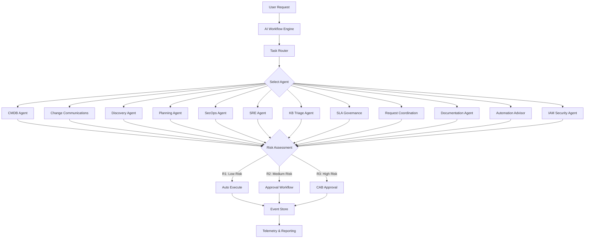
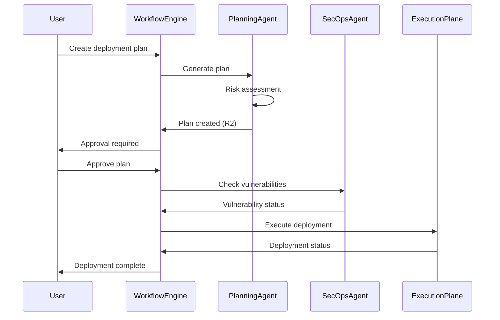
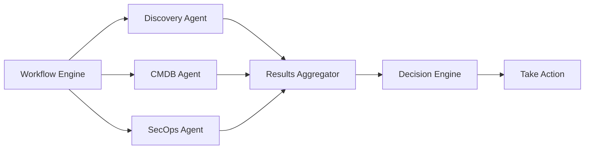
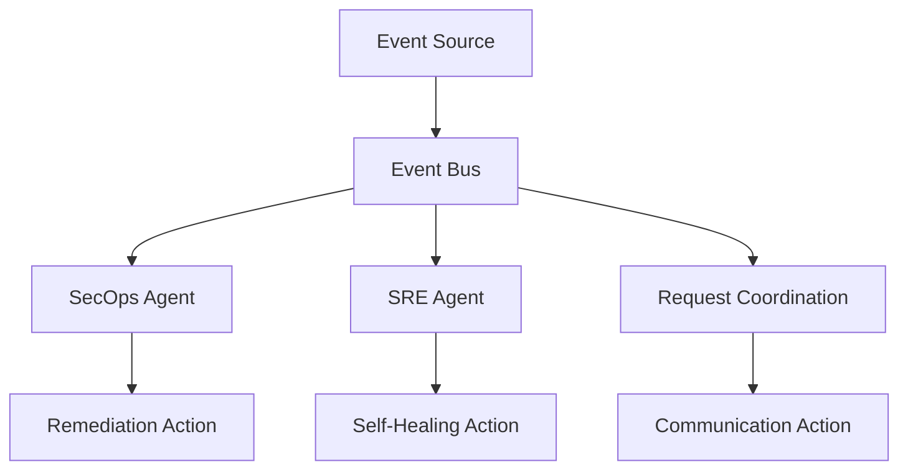
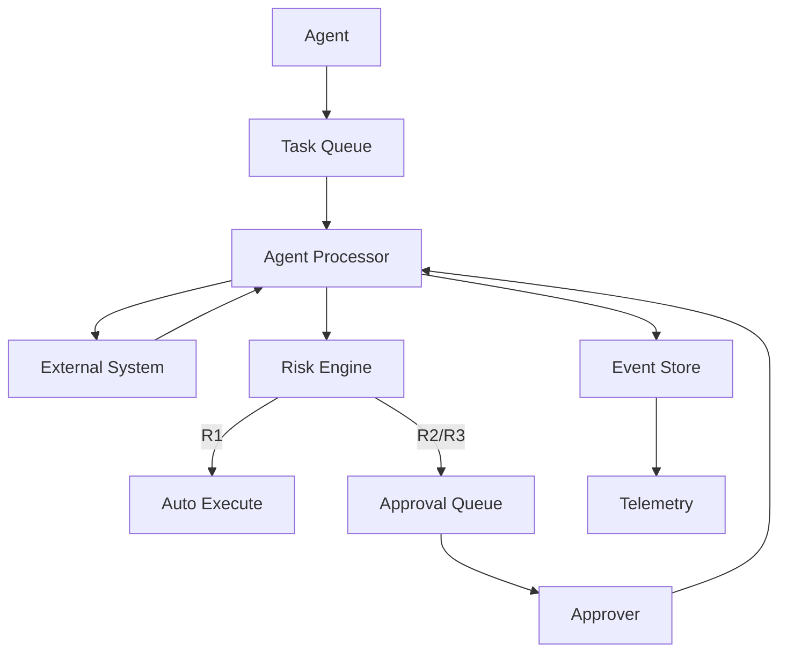

# AI Agents Architecture

**Version**: 1.0
**Status**: Design
**Last Updated**: 2026-01-31

---

## Overview

The AI Agents Architecture defines how AI-powered agents are orchestrated within EUCORA to automate application lifecycle management tasks. This architecture supports 12 specialized agents (E10-E21) that work together to provide intelligent automation across the platform.

## Architecture Principles

1. **Agent Autonomy**: Agents operate autonomously within defined risk boundaries (R1/R2/R3)
2. **Workflow Orchestration**: Agents are coordinated through the AI Workflow Engine (E8)
3. **Deterministic Decisions**: All agent decisions are explainable and auditable
4. **Correlation Tracking**: All agent actions include correlation IDs for audit trails

---

## AI Agent Orchestration Flow

---

## Agent Risk Classification

Agents classify operations into three risk levels:

### R1: Autonomous Operations (Low Risk)
- Read-only operations
- Informational alerts
- Documentation updates
- Non-critical data synchronization

**Example**: CMDB data sync, knowledge base article indexing

### R2: Approval Required (Medium Risk)
- Configuration changes
- Non-critical patches
- Data updates
- Workflow state changes

**Example**: Remediation plan creation, SLA definition updates

### R3: Mandatory Approval (High Risk)
- Critical patches
- Emergency changes
- Bulk operations
- Security actions

**Example**: Access revocation, critical vulnerability remediation

---

## Agent Coordination Patterns

### Pattern 1: Sequential Workflow

### Pattern 2: Parallel Processing

### Pattern 3: Event-Driven Coordination

---

## Agent Integration Points

### 1. Workflow Engine Integration

All agents integrate with the AI Workflow Engine (E8) through:
- **Task API**: Agents receive tasks from workflow engine
- **Status Updates**: Agents report task status and progress
- **Approval Requests**: Agents request approvals for R2/R3 operations
- **Event Publishing**: Agents publish events to event store

### 2. RAG Pipeline Integration

Agents that require knowledge access (KB Triage, Documentation) integrate with:
- **Vector Storage**: Semantic search using pgvector (E7)
- **Document Management**: Document ingestion and indexing (E1)
- **Knowledge Sources**: ServiceNow KB, Confluence, SharePoint

### 3. External System Integration

Agents integrate with external systems through connectors:
- **ServiceNow**: CMDB, Change, Request, KB, IAM
- **SIEM Platforms**: Splunk, Sentinel, QRadar (SecOps)
- **Monitoring**: Prometheus, Datadog, Azure Monitor (SRE)
- **Vulnerability Scanners**: Qualys, Nessus, Rapid7 (SecOps)

---

## Agent Data Flow

---

## Agent Telemetry and Monitoring

All agents publish telemetry including:
- **Task Execution Metrics**: Success rate, duration, error rate
- **Risk Classification**: Distribution of R1/R2/R3 operations
- **Approval Metrics**: Approval rate, average approval time
- **Integration Health**: External system connectivity status

---

## Security and Compliance

### Authentication
- Agents authenticate using service principals with Entra ID
- Each agent has scoped permissions based on its responsibilities

### Audit Trail
- All agent actions include correlation IDs
- Agent decisions are logged with reasoning
- Approval workflows are fully auditable

### Data Isolation
- Agents respect correlation ID boundaries
- Multi-tenant isolation enforced at agent level
- Agent data scoped by acquisition boundary

---

## Related Documentation

- [ALM Agents Architecture](alm-agents-architecture.md)
- [RAG Pipeline Architecture](rag-pipeline-architecture.md)
- [Control Plane Design](control-plane-design.md)
- [Planning Document: AI Agent Workflows](../planning/17-ai-agent-workflows.md)
