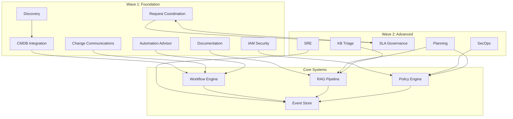
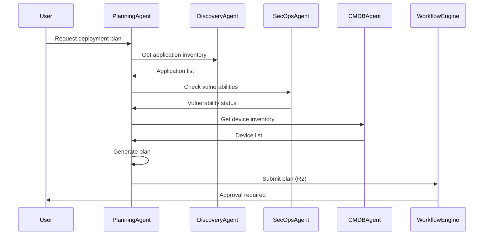
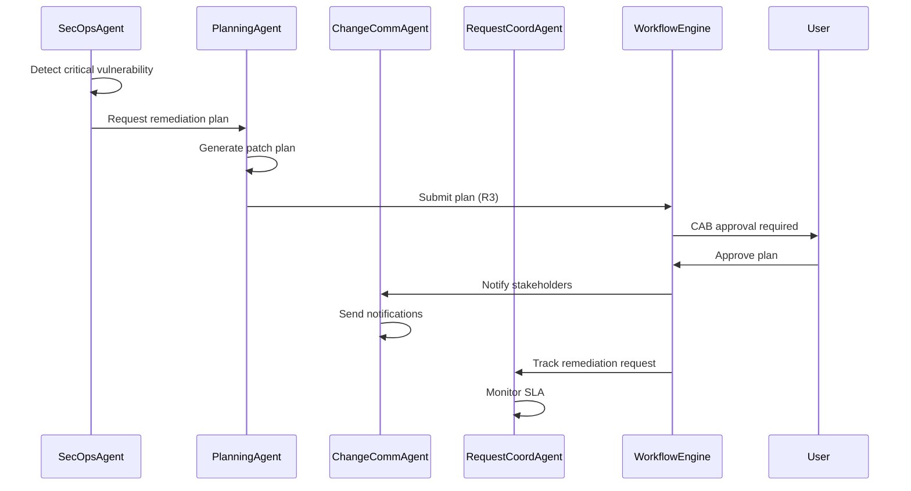
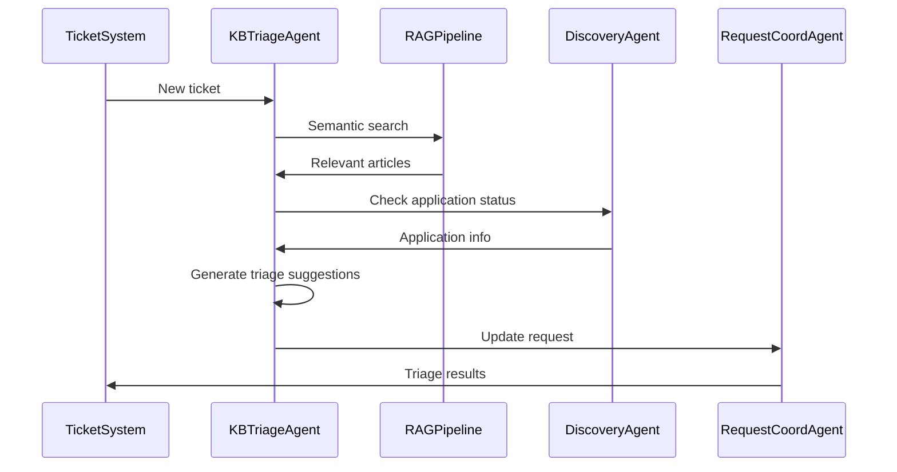
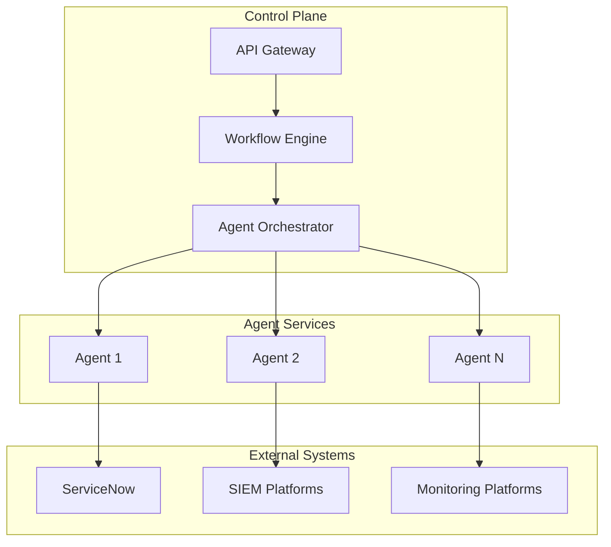

# ALM Agents Architecture

**Version**: 1.0
**Status**: Design
**Last Updated**: 2026-01-31

---

## Overview

The ALM (Application Lifecycle Management) Agents Architecture defines the 12 specialized agents (E10-E21) that automate various aspects of the application lifecycle. These agents are organized into two waves: Wave 1 (E10-E16) and Wave 2 (E17-E21).

---

## Agent Catalog

### Wave 1: Foundation Agents (E10-E16)

#### E10: CMDB Integration Agent
**Purpose**: Keeps ServiceNow CMDB synchronized with discovery tools and deployment pipelines
**Key Capabilities**:
- Multi-source data ingestion (SCCM, Intune, Discovery)
- Data quality validation
- Discrepancy detection and resolution
- Bidirectional sync support

**Integration Points**: ServiceNow CMDB, SCCM, Intune, Discovery tools

#### E11: Change Communications Agent
**Purpose**: Manages ServiceNow change records and stakeholder communications
**Key Capabilities**:
- Change record synchronization
- Multi-channel notifications (Email, Teams, Slack)
- Communication template management
- KB article linking

**Integration Points**: ServiceNow Change Management, Email, Teams, Slack

#### E12: Documentation Agent
**Purpose**: Automatically generates documentation from codebases
**Key Capabilities**:
- Repository analysis (GitHub, GitLab, local)
- API documentation generation
- README and architecture doc generation
- Module documentation tracking

**Integration Points**: GitHub, GitLab, RAG Pipeline (E7)

#### E13: Automation Advisor Agent
**Purpose**: Identifies automation opportunities and calculates ROI
**Key Capabilities**:
- Task pattern detection
- Automation candidate scoring
- ROI analysis and calculation
- Implementation tracking

**Integration Points**: Task tracking systems, workflow engine

#### E14: Discovery Agent
**Purpose**: Multi-source application discovery and normalization
**Key Capabilities**:
- Application discovery from multiple sources
- Application name normalization
- License gap detection
- Patch gap detection

**Integration Points**: SCCM, Intune, AD, CMDB, spreadsheets

#### E15: IAM Security Agent
**Purpose**: Monitors identity provider access and detects security anomalies
**Key Capabilities**:
- Sign-in event monitoring
- Anomaly detection
- Permission change tracking
- Security alert management

**Integration Points**: Entra ID, Okta, AD, ServiceNow IAM

#### E16: Request Coordination Agent
**Purpose**: Tracks ServiceNow requests and manages SLA compliance
**Key Capabilities**:
- Request lifecycle tracking
- SLA monitoring and breach detection
- Escalation management
- Stakeholder communications

**Integration Points**: ServiceNow Request Management, Email, Teams, Slack

### Wave 2: Advanced Agents (E17-E21)

#### E17: SecOps Agent
**Purpose**: Vulnerability management and security compliance
**Key Capabilities**:
- Vulnerability scanning integration
- CVE tracking and remediation
- SIEM integration
- Compliance monitoring (CIS, NIST, SOC2, ISO27001)

**Integration Points**: Qualys, Nessus, Rapid7, Defender, Splunk, Sentinel, QRadar

#### E18: SRE Agent
**Purpose**: Site reliability engineering automation
**Key Capabilities**:
- Monitoring platform integration
- Health check automation
- SLO tracking and error budget management
- Self-healing automation
- Runbook execution

**Integration Points**: Prometheus, Datadog, Azure Monitor, New Relic

#### E19: SLA Governance Agent
**Purpose**: SLA definition and compliance monitoring
**Key Capabilities**:
- SLA definition with natural language support
- KPI tracking
- Compliance monitoring
- Breach detection and alerting

**Integration Points**: ServiceNow Service Catalog, KPI measurement systems

#### E20: Planning Agent
**Purpose**: AI-powered deployment planning
**Key Capabilities**:
- Natural language plan generation
- Ring assignment optimization
- Blast radius analysis
- Schedule optimization
- Rollback plan generation

**Integration Points**: Application Portfolio, Deployment Intents, RAG Pipeline

#### E21: KB & Triage Agent
**Purpose**: Knowledge base integration and AI-powered ticket triage
**Key Capabilities**:
- Knowledge source integration
- Semantic search
- AI-powered ticket triage
- Incident pattern detection
- Resolution guidance

**Integration Points**: ServiceNow KB, Confluence, SharePoint, RAG Pipeline (E7)

---

## Agent Relationships

---

## Agent Coordination Scenarios

### Scenario 1: Deployment Planning Flow

### Scenario 2: Vulnerability Remediation Flow

### Scenario 3: Ticket Triage Flow

---

## Agent Data Model

### Common Agent Patterns

All agents follow these common patterns:

1. **Correlation ID Tracking**: Every agent action includes a correlation ID
2. **Risk Classification**: Operations classified as R1/R2/R3
3. **Approval Workflows**: R2/R3 operations require approval
4. **Event Publishing**: All actions publish events to event store
5. **Telemetry**: Agents publish metrics and health status

### Agent-Specific Models

Each agent has domain-specific models:
- **CMDB Agent**: CMDBConnection, CMDBTableMapping, CMDBDiscrepancy
- **SecOps Agent**: Vulnerability, VulnerabilityInstance, RemediationPlan
- **SRE Agent**: HealthEndpoint, SLODefinition, SelfHealingRule
- **Planning Agent**: DeploymentPlan, RingAssignment, BlastRadiusAnalysis

---

## Agent Deployment Architecture

---

## Agent Monitoring and Observability

### Health Monitoring
- Agent health endpoints
- External system connectivity status
- Task queue depth
- Error rates

### Performance Metrics
- Task execution time
- API response times
- External system latency
- Throughput (tasks per minute)

### Business Metrics
- Tasks completed
- Approvals processed
- Automation success rate
- Cost savings (for Automation Advisor)

---

## Related Documentation

- [AI Agents Architecture](ai-agents-architecture.md)
- [RAG Pipeline Architecture](rag-pipeline-architecture.md)
- [Control Plane Design](control-plane-design.md)
- [Planning Documents](../planning/)
