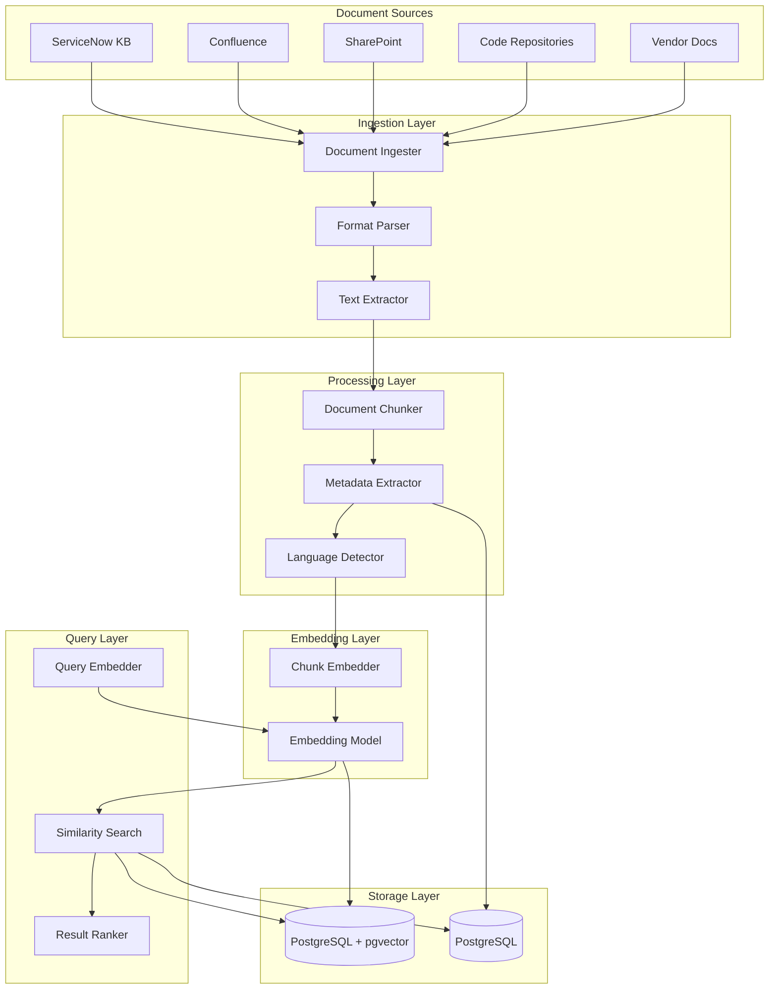
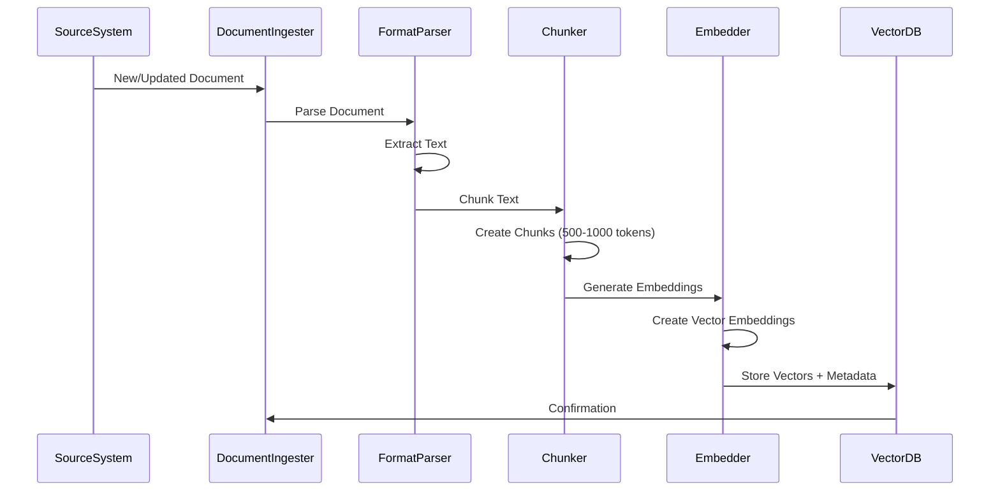
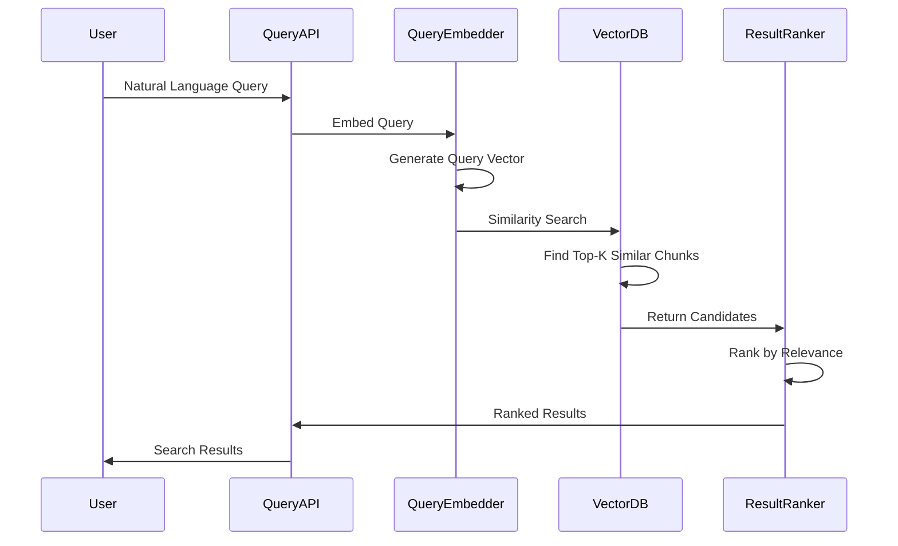
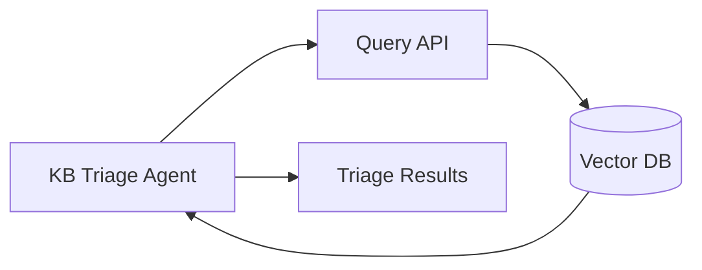
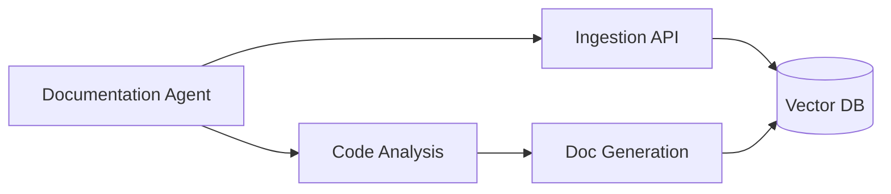
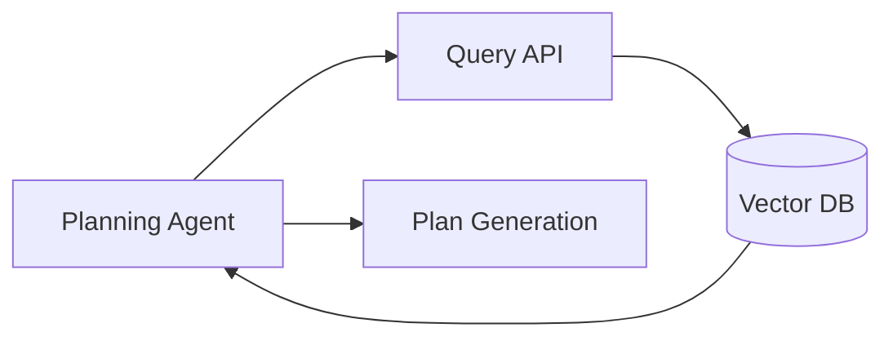

# RAG Pipeline Architecture

**Version**: 1.0
**Status**: Design
**Last Updated**: 2026-01-31

---

## Overview

The RAG (Retrieval-Augmented Generation) Pipeline Architecture defines how EUCORA ingests, processes, stores, and retrieves documents for AI-powered agents. The pipeline supports semantic search, knowledge base integration, and AI-assisted decision making.

## Architecture Components

### 1. Document Ingestion

Documents are ingested from multiple sources:
- **ServiceNow KB**: Knowledge base articles
- **Confluence**: Documentation pages
- **SharePoint**: Policy documents and guides
- **Code Repositories**: README files, API docs, code comments
- **Vendor Documentation**: External documentation sources

### 2. Document Processing

Documents undergo processing pipeline:
- **Text Extraction**: Extract text from various formats (PDF, DOCX, HTML, Markdown)
- **Chunking**: Split documents into manageable chunks
- **Metadata Extraction**: Extract title, author, date, category, tags
- **Language Detection**: Detect document language

### 3. Vector Embedding

Documents are converted to vector embeddings:
- **Embedding Model**: OpenAI text-embedding-ada-002 or Azure OpenAI embeddings
- **Chunk Embedding**: Each chunk is embedded separately
- **Metadata Embedding**: Metadata is included in embedding context

### 4. Vector Storage

Embeddings are stored in PostgreSQL with pgvector extension:
- **Vector Index**: HNSW index for fast similarity search
- **Metadata Storage**: Document metadata stored alongside vectors
- **Versioning**: Support for document versioning

### 5. Semantic Search

Semantic search enables natural language queries:
- **Query Embedding**: User queries are embedded
- **Similarity Search**: Find similar documents using vector similarity
- **Ranking**: Results ranked by relevance score
- **Filtering**: Filter by metadata (source, category, date)

---

## RAG Pipeline Flow



---

## Document Ingestion Process



---

## Semantic Search Process



---

## Vector Storage Schema

### Document Table
```sql
CREATE TABLE documents (
    id UUID PRIMARY KEY,
    source_type VARCHAR(50),
    external_id VARCHAR(255),
    title VARCHAR(500),
    content TEXT,
    metadata JSONB,
    created_at TIMESTAMP,
    updated_at TIMESTAMP
);
```

### Document Chunks Table
```sql
CREATE TABLE document_chunks (
    id UUID PRIMARY KEY,
    document_id UUID REFERENCES documents(id),
    chunk_index INTEGER,
    content TEXT,
    embedding vector(1536),  -- OpenAI ada-002 dimension
    metadata JSONB,
    created_at TIMESTAMP
);

CREATE INDEX ON document_chunks USING hnsw (embedding vector_cosine_ops);
```

---

## Integration with Agents

### KB & Triage Agent Integration



**Use Cases**:
- Semantic search for ticket resolution
- Finding similar past incidents
- Retrieving relevant knowledge articles

### Documentation Agent Integration



**Use Cases**:
- Indexing code documentation
- Generating API documentation
- Creating architecture documentation

### Planning Agent Integration



**Use Cases**:
- Retrieving deployment best practices
- Finding similar deployment scenarios
- Accessing rollback procedures

---

## Performance Considerations

### Indexing Performance
- **Batch Processing**: Process documents in batches
- **Parallel Processing**: Parallelize embedding generation
- **Incremental Updates**: Only re-index changed documents

### Query Performance
- **Vector Index**: HNSW index for fast similarity search
- **Result Caching**: Cache frequent queries
- **Limit Results**: Return top-K results (default: 10)

### Scalability
- **Horizontal Scaling**: Scale embedding service independently
- **Database Sharding**: Shard by source or category if needed
- **CDN Caching**: Cache static document content

---

## Security and Compliance

### Access Control
- **Source-Level Access**: Control access by document source
- **Category-Level Access**: Control access by document category
- **RBAC Integration**: Integrate with EUCORA RBAC system

### Data Privacy
- **PII Detection**: Detect and redact PII from documents
- **Encryption**: Encrypt documents at rest
- **Audit Logging**: Log all document access

### Compliance
- **Retention Policies**: Enforce document retention policies
- **Data Classification**: Classify documents by sensitivity
- **Compliance Reporting**: Generate compliance reports

---

## Monitoring and Observability

### Metrics
- **Ingestion Rate**: Documents ingested per hour
- **Embedding Latency**: Time to generate embeddings
- **Query Latency**: Query response time
- **Index Size**: Number of vectors in index

### Alerts
- **Ingestion Failures**: Alert on ingestion errors
- **High Query Latency**: Alert on slow queries
- **Index Health**: Alert on index issues

---

## Related Documentation

- [AI Agents Architecture](ai-agents-architecture.md)
- [ALM Agents Architecture](alm-agents-architecture.md)
- [Planning Document: Document Management & RAG](../planning/01-document-management-rag.md)
- [Planning Document: Vector Storage](../planning/07-vector-storage-pgvector.md)
